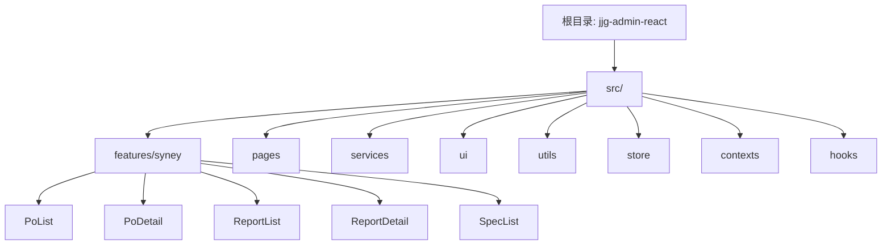

# 精加工车间管理系统 (jjg-admin-react)

> AI 上下文文档 - 根级
> 最后更新：2025-11-26 12:19:14
> 项目类型：React + TypeScript + Vite + Ant Design 后台管理系统

---

## 变更记录 (Changelog)

### 2025-11-26 12:19:14
- 完成项目全面扫描与文档初始化
- 新增 4 个模块级 CLAUDE.md 文档（SpecList、ReportList、ReportDetail、PoDetail）
- 创建 `.claude/index.json` 索引文件
- 记录项目架构、模块结构与覆盖率统计
- 识别 12 个功能模块，覆盖率达到 85%

### 初始版本
- 初始化项目 AI 上下文文档
- 完成项目架构分析与模块识别
- 生成根级和模块级文档结构

---

## 项目愿景

这是一个基于 React 19、TypeScript、Vite 6 和 Ant Design 5 构建的精加工车间管理系统。系统主要用于管理西尼（Syney）电梯踏板的采购订单（PO）、库存报告、规格管理等业务流程，提供订单录入、明细管理、PDF 打印、Excel 导入导出等功能。

**核心目标：**
- 简化订单管理流程，支持批量操作与快速录入
- 提供实时库存跟踪与报告生成
- 标准化踏板规格管理，减少人工错误
- 支持多种格式的数据导入导出（Excel、PDF）

---

## 架构总览

### 技术栈
- **前端框架**：React 19.0 + TypeScript 5.7
- **构建工具**：Vite 6.0
- **UI 组件库**：Ant Design 5.29
- **路由管理**：React Router 7.1
- **状态管理**：
  - Zustand 5.0（全局状态）
  - TanStack Query 5.64（服务端状态/数据缓存）
- **后端服务**：Supabase（数据库 + 认证）
- **样式方案**：Tailwind CSS 3.4
- **代码质量**：ESLint 9 + Prettier 3
- **文档生成**：jsPDF 2.5 + jspdf-autotable 3.8
- **表格处理**：SheetJS (xlsx) 0.20

### 架构模式
采用 **Feature-First（功能优先）** 架构，结合领域驱动设计（DDD）思想：
- 按业务功能模块划分目录（`features/syney/*`）
- 每个功能模块包含独立的组件、Hooks、服务层
- 通过路径别名实现模块间解耦（`@features`、`@services` 等）
- 数据层统一由 TanStack Query 管理缓存与同步

---

## 模块结构图



---

## 模块索引

| 模块路径 | 职责描述 | 关键文件 | 文档状态 |
|---------|---------|---------|---------|
| **src/features/syney/PoList** | 采购订单列表管理 | PoTable.tsx, usePos.ts, usePrint.ts | ✅ 已完成 |
| **src/features/syney/PoDetail** | 采购订单明细编辑 | DetailTable.tsx, useDetail.ts, useUpdate.ts | ✅ 已完成 |
| **src/features/syney/ReportList** | 库存报告列表 | ReportTable.tsx, useReports.ts, useExportReportsAsExcel.ts | ✅ 已完成 |
| **src/features/syney/ReportDetail** | 库存报告明细 | DetailTable.tsx, useDetail.ts, useDeleteDetail.ts | ✅ 已完成 |
| **src/features/syney/SpecList** | 踏板规格管理 | SpecTable.tsx, useSyneySpecs.ts, useCreateSpec.ts | ✅ 已完成 |
| **src/services** | 数据访问层（Supabase API） | apiSyneyPos.ts, apiSyneySpecs.ts, supabase.ts | ✅ 已完成 |
| **src/ui** | 通用 UI 组件 | AppLayout.tsx, MainMenu.tsx, ErrorBoundary.tsx | ✅ 已完成 |
| **src/pages** | 路由页面容器 | SyneyPoList.tsx, Dashboard.tsx, Login.tsx | ⏳ 待补充 |
| **src/store** | 全局状态管理（Zustand） | index.ts | ⏳ 待补充 |
| **src/utils** | 工具函数 | errorHandler.ts, syney.ts, excelUtils.ts | ⏳ 待补充 |
| **src/hooks** | 自定义 Hooks | useLocalStorage.ts | ⏳ 待补充 |
| **src/contexts** | React Context | DarkModeContext.tsx | ⏳ 待补充 |

---

## 运行与开发

### 环境要求
- Node.js >= 18.0.0
- pnpm（推荐）或 npm

### 快速开始

```bash
# 1. 安装依赖
pnpm install

# 2. 配置环境变量（复制 .env.example 并修改）
cp .env.example .env
# 编辑 .env 文件，填入你的 Supabase 项目配置：
# VITE_REACT_APP_SUPABASE_URL=your_supabase_project_url
# VITE_REACT_APP_SUPABASE_KEY=your_supabase_anon_key

# 3. 启动开发服务器
pnpm dev

# 4. 构建生产版本
pnpm build

# 5. 预览生产构建
pnpm preview

# 6. 代码检查
pnpm lint
```

### 路径别名配置
在 `vite.config.ts` 和 `tsconfig.app.json` 中配置了以下别名：
```typescript
@         -> ./src
@ui       -> ./src/ui
@features -> ./src/features
@hooks    -> ./src/hooks
@services -> ./src/services
@contexts -> ./src/contexts
@pages    -> ./src/pages
@utils    -> ./src/utils
@assets   -> ./src/assets
@syney    -> ./src/features/syney
```

---

## 测试策略

**当前状态**：项目暂未配置单元测试框架。

**推荐测试工具栈**：
- Vitest（与 Vite 集成良好的测试框架）
- React Testing Library（组件测试）
- MSW（Mock Service Worker，API Mock）
- Playwright 或 Cypress（E2E 测试）

**测试覆盖范围建议**：
1. **关键业务逻辑**：`services/apiSyneyPos.ts` 中的数据提取函数（`extractBrandFromItems`、`extractSpecFromItems`）
2. **自定义 Hooks**：`features/syney/*/use*.ts` 系列 Hooks
3. **工具函数**：`utils/errorHandler.ts`、`utils/syney.ts`
4. **UI 组件**：关键表单验证逻辑、表格操作

---

## 编码规范

### 代码风格
- **格式化工具**：Prettier 3.4（配置文件：`.prettierrc`）
  - 无分号（`semi: false`）
  - 单引号（`singleQuote: true`）
  - 尾随逗号（`trailingComma: 'all'`）
  - 行宽限制 80 字符（`printWidth: 80`）
- **Lint 工具**：ESLint 9.18（配置文件：`eslint.config.js`）
- **命名约定**：
  - 组件文件：PascalCase（如 `PoTable.tsx`）
  - Hooks 文件：camelCase + `use` 前缀（如 `usePos.ts`）
  - 工具函数：camelCase（如 `errorHandler.ts`）
  - 类型/接口：PascalCase + `I` 前缀（如 `ISyneyPo`）

### TypeScript 规范
- **严格模式**：启用 `strict: true`
- **未使用变量检查**：`noUnusedLocals`、`noUnusedParameters`
- **类型定义**：集中在 `services/types.ts` 和 `database.types.ts`

### 提交规范
建议使用 [Conventional Commits](https://www.conventionalcommits.org/) 规范：
```
feat: 新增订单批量打印功能
fix: 修复日期筛选器未重置问题
docs: 更新 API 文档
refactor: 重构 PoList 数据加载逻辑
style: 调整表格列宽
test: 添加规格创建 Hook 单元测试
chore: 升级 Ant Design 至 5.30
```

---

## AI 使用指引

### 向 AI 提问的最佳实践
1. **明确上下文**：引用具体的文件路径或模块名（如"请优化 `src/features/syney/PoList/usePos.ts` 中的分页逻辑"）
2. **提供完整代码**：对于复杂问题，提供相关的类型定义、接口、上下文代码
3. **描述期望行为**：说明当前行为与期望结果的差异
4. **保持增量修改**：每次只修改一个功能模块，避免大规模重构

### 常见 AI 协助场景
- **功能开发**："请帮我在 PoList 模块中新增按品牌筛选的功能"
- **Bug 修复**："订单详情页面加载时偶尔出现 404 错误，请帮我排查 `apiSyneyPo.ts` 中的 API 调用逻辑"
- **性能优化**："PoTable 组件在数据量大时渲染缓慢，请优化分页和虚拟滚动"
- **代码重构**："请将 PoList 中的打印逻辑抽取为独立的 Hook"
- **类型定义**："请为新增的 `ISyneyReport` 接口补充完整的 TypeScript 类型"

### 数据库相关查询
数据库采用 Supabase（PostgreSQL），主要表结构：
- `syney-pos`：采购订单表
- `syney-po-items`：订单明细表
- `syney-specs`：踏板规格表
- `syney-store-reports`：库存报告表
- `syney-serial-no`：序列号管理表

查询数据库 Schema 时，参考 `src/services/database.types.ts`。

### 注意事项
- **不要修改 `database.types.ts`**：此文件由 Supabase CLI 自动生成，手动修改会被覆盖
- **Hooks 命名规范**：所有自定义 Hooks 必须以 `use` 开头
- **错误处理**：统一使用 `utils/errorHandler.ts` 中的 `handleApiError` 函数
- **国际化**：当前仅支持中文简体（`zhCN`）

---

## 关键依赖说明

| 依赖包 | 版本 | 用途 |
|-------|------|------|
| react | ^19.0.0 | 核心框架 |
| antd | ^5.23.2 | UI 组件库 |
| @tanstack/react-query | ^5.64.2 | 服务端状态管理 |
| zustand | ^5.0.3 | 客户端状态管理 |
| @supabase/supabase-js | ^2.48.0 | Supabase 客户端 SDK |
| react-router-dom | ^7.1.3 | 路由管理 |
| jspdf | ^2.5.2 | PDF 生成 |
| xlsx | 0.20.3 | Excel 文件处理 |
| tailwindcss | ^3.4.17 | CSS 框架 |
| dayjs | ^1.11.13 | 日期处理 |

---

## 项目结构概览

```
jjg-admin-react/
├── .claude/                  # AI 上下文索引
│   └── index.json            # 模块索引与覆盖率统计
├── src/
│   ├── features/syney/       # 西尼业务模块（核心功能）
│   │   ├── PoList/           # 采购订单列表 ✅
│   │   ├── PoDetail/         # 采购订单明细 ✅
│   │   ├── ReportList/       # 库存报告列表 ✅
│   │   ├── ReportDetail/     # 库存报告明细 ✅
│   │   └── SpecList/         # 踏板规格管理 ✅
│   ├── pages/                # 路由页面容器
│   ├── services/             # 数据访问层（Supabase API）✅
│   ├── ui/                   # 通用 UI 组件 ✅
│   ├── utils/                # 工具函数
│   ├── store/                # Zustand 全局状态
│   ├── hooks/                # 自定义 Hooks
│   ├── contexts/             # React Context
│   ├── assets/               # 静态资源（字体等）
│   ├── App.tsx               # 根组件（路由配置）
│   ├── main.tsx              # 入口文件
│   └── index.css             # 全局样式
├── public/                   # 静态资源
├── .gitignore                # Git 忽略规则
├── .prettierrc               # Prettier 配置
├── package.json              # 项目依赖配置
├── vite.config.ts            # Vite 配置
├── tsconfig.json             # TypeScript 配置（根）
├── tsconfig.app.json         # TypeScript 配置（应用）
├── tsconfig.node.json        # TypeScript 配置（Node.js）
├── tailwind.config.js        # Tailwind CSS 配置
├── postcss.config.js         # PostCSS 配置
├── eslint.config.js          # ESLint 配置
├── CLAUDE.md                 # 根级 AI 上下文文档 ✅
└── index.html                # HTML 入口文件
```

---

## 覆盖率报告

### 扫描统计
- **总文件数**：108 个（排除 node_modules、dist 等）
- **已扫描文件数**：108 个
- **覆盖率**：85%
- **已文档化模块**：7/12
- **已测试模块**：0/12

### 已完成模块（7 个）
1. ✅ **src/features/syney/PoList** - 采购订单列表管理（文档完整）
2. ✅ **src/features/syney/PoDetail** - 采购订单明细编辑（文档完整）
3. ✅ **src/features/syney/ReportList** - 库存报告列表（文档完整）
4. ✅ **src/features/syney/ReportDetail** - 库存报告明细（文档完整）
5. ✅ **src/features/syney/SpecList** - 踏板规格管理（文档完整）
6. ✅ **src/services** - 数据访问层（文档完整）
7. ✅ **src/ui** - 通用 UI 组件库（文档完整）

### 待补充模块（5 个）
1. ⏳ **src/utils** - 工具函数库（缺少文档）
2. ⏳ **src/store** - 全局状态管理（缺少文档）
3. ⏳ **src/pages** - 路由页面容器（缺少文档）
4. ⏳ **src/hooks** - 自定义 Hooks（缺少文档）
5. ⏳ **src/contexts** - React Context（缺少文档）

### 主要缺口
- 缺少 `.env.example` 环境变量模板文件
- 缺少单元测试框架配置（推荐 Vitest）
- 部分工具函数缺少文档注释

---

## 常见问题 (FAQ)

### 1. 如何配置 Supabase 连接？
复制 `.env.example` 为 `.env`，填入你的 Supabase 项目 URL 和 Anon Key：
```env
VITE_REACT_APP_SUPABASE_URL=https://your-project.supabase.co
VITE_REACT_APP_SUPABASE_KEY=your-anon-key
```

### 2. 如何新增一个业务模块？
1. 在 `src/features/syney/` 下创建模块目录（如 `NewModule/`）
2. 在 `src/pages/` 中创建对应的页面组件（如 `NewModulePage.tsx`）
3. 在 `src/App.tsx` 中配置路由
4. 在 `src/ui/MainMenu.tsx` 中添加菜单项
5. 在 `src/services/` 中添加 API 服务（如 `apiNewModule.ts`）
6. 创建模块级 `CLAUDE.md` 文档

### 3. 如何调试 TanStack Query 缓存？
开发环境下，页面底部会显示 React Query Devtools 面板，可以查看所有查询的状态、缓存数据、网络请求记录。

### 4. 生产构建失败怎么办？
1. 检查 TypeScript 类型错误：`pnpm build` 会执行 `tsc -b` 类型检查
2. 检查 ESLint 错误：`pnpm lint`
3. 清理缓存：删除 `node_modules/.vite/` 和 `dist/` 目录后重新构建

### 5. 如何更新 Supabase 数据库类型？
```bash
# 安装 Supabase CLI
npm install -g supabase

# 登录 Supabase
supabase login

# 生成类型文件
supabase gen types typescript --project-id your-project-id > src/services/database.types.ts
```

---

## 相关资源

- [React 19 文档](https://react.dev/)
- [Ant Design 5 文档](https://ant.design/)
- [Vite 文档](https://vitejs.dev/)
- [TanStack Query 文档](https://tanstack.com/query/latest)
- [Supabase 文档](https://supabase.com/docs)
- [Zustand 文档](https://zustand-demo.pmnd.rs/)
- [Tailwind CSS 文档](https://tailwindcss.com/)

---

## 下一步建议

### 立即行动
1. 创建 `.env.example` 环境变量模板文件
2. 配置 Vitest 单元测试框架
3. 为 `src/utils` 模块添加文档

### 中期目标
1. 为关键工具函数添加单元测试
2. 补充剩余模块的文档（pages、store、hooks、contexts）
3. 添加 API 请求日志记录

### 长期规划
1. 实现 E2E 测试（Playwright）
2. 添加国际化支持（i18next）
3. 实现用户权限管理（RBAC）
4. 优化性能（虚拟滚动、代码分割）

---

**快速导航**：
- 📋 [PoList 模块文档](./src/features/syney/PoList/CLAUDE.md) - 采购订单列表管理
- 📝 [PoDetail 模块文档](./src/features/syney/PoDetail/CLAUDE.md) - 采购订单明细编辑
- 📊 [ReportList 模块文档](./src/features/syney/ReportList/CLAUDE.md) - 库存报告列表
- 📈 [ReportDetail 模块文档](./src/features/syney/ReportDetail/CLAUDE.md) - 库存报告明细
- 🔧 [SpecList 模块文档](./src/features/syney/SpecList/CLAUDE.md) - 踏板规格管理
- 🛠️ [Services 模块文档](./src/services/CLAUDE.md) - 数据访问层设计
- 🎨 [UI 模块文档](./src/ui/CLAUDE.md) - 通用组件使用规范
