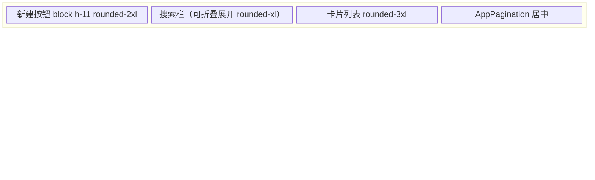

# 物料转移单 UI 设计风格

> 本文档记录 `/material-transfer` 页面的视觉设计规范、组件使用模式和最佳实践，供后续迭代和团队参考。

---

## 1. 页面定位与双视图架构

物料转移单页面同时服务于两套角色，形成两套独立的 UI 体验：

| 视图 | 角色 | 核心场景 |
|------|------|---------|
| 管理后台视图 | 管理员 / 非员工端 | 列表浏览、批量操作、审核、导出 |
| 员工端视图 | 一线操作员工 | 扫码录入、查看我的转移单 |

两套视图通过 `isEmployeeSideRole(role)` 条件渲染，数据源和业务逻辑共享，仅 UI 层差异化实现。

---

## 2. 桌面端（管理后台）设计规范

### 2.1 整体布局

```mermaid
block-beta
  columns 1
  block:header:12
    H["顶部工具栏: 新建 / 批量审核 / 批量反审核 / 编辑 / 导出 / 删除"]
  end
  block:summary:12
    S["选中摘要条（条件渲染，仅选中 > 0 时显示）"]
  end
  block:content:24
    columns 1
    block:search:8
      SEARCH["搜索栏（inline form + rounded-lg 容器）"]
    end
    block:splitter:16
      C["Splitter 上下分栏"]
      C1["表格区 65%（可拖拽调整）"]
      C2["详情面板 35%"]
    end
  end
```



布局代码结构：

```tsx
<div className="flex h-full flex-col gap-3 overflow-hidden">
  {/* 顶部工具栏 */}
  <div className="flex flex-wrap items-center gap-2">
    <AddButton ... />
    <Button type="text" icon={<ShieldCheckIcon ... />} ...>批量审核</Button>
    <Button type="text" icon={<ArrowPathIcon ... />} ...>批量反审核</Button>
    <EditButton ... />
    <ExportButton ... />
    <DeleteButton ... />
  </div>

  {/* 选中摘要条 */}
  <div className="flex ... rounded-2xl border border-blue-200/60 bg-gradient-to-r from-blue-50/80 via-indigo-50/80 to-blue-50/80 px-5 py-3 shadow-[0_8px_30px_rgba(59,130,246,0.12)] backdrop-blur-sm">
    {/* SVG 图标圆角背景 + 数字 bold */}
  </div>

  {/* 搜索栏 */}
  <div className="flex flex-col gap-2 rounded-lg border border-slate-200/60 bg-white p-4 shadow-sm">
    <Form layout="inline" className="flex flex-1 flex-wrap items-center gap-3">
      {/* 字段... */}
    </Form>
  </div>

  {/* Splitter 分栏 */}
  <Splitter layout="vertical" style={{ flex: 1, minHeight: 0 }}>
    <Splitter.Panel defaultSize="65%" min="30%">
      <MaterialTransferTable ... />
      <AppPagination ... />
    </Splitter.Panel>
    <Splitter.Panel min="20%">
      <MaterialTransferDetail ... />
    </Splitter.Panel>
  </Splitter>
</div>
```

### 2.2 搜索栏

- **容器**：`rounded-lg border border-slate-200/60 bg-white p-4 shadow-sm`
- **布局**：`Form layout="inline"` + `flex flex-wrap items-center gap-3`
- **字段圆角**：`className="rounded-lg"`
- **下拉弹出层**：统一设置 `minWidth`，`getPopupContainer={() => document.body}`
- **筛选指示器**：`flex items-center gap-2` + `h-1.5 w-1.5 rounded-full bg-blue-500`
- **展开/收起**：`ChevronDownIcon` + `rotate-180` + `transition-transform duration-200`

### 2.3 表格

- **尺寸**：`size="small"`, `style={{ fontSize: '13px' }}`
- **列宽固定**：序号 50px、创建时间 165px、审核状态 90px、项目号 130px 等
- **列排序/筛选**：项目号 `sorter` + `filterSearch` + `defaultSortOrder: 'ascend'`
- **审核状态列**：

```tsx
<div className={`inline-flex items-center gap-1.5 rounded-full px-2 py-0.5 text-xs font-medium shadow-sm ${
  value ? 'bg-emerald-50 text-emerald-600' : 'bg-slate-100 text-slate-500'
}`}>
  <div className={`h-1.5 w-1.5 rounded-full ${value ? 'bg-emerald-500' : 'bg-slate-400'}`} />
  {value ? '已审核' : '待审核'}
</div>
```

- **接收车间列**：pill badge

```tsx
<span className="inline-flex items-center rounded-full bg-slate-100 px-2 py-0.5 text-xs font-medium text-slate-600">
  {value}
</span>
```

- **行点击高亮**：`backgroundColor: record.id === activeRowId ? '#f0f7ff' : undefined`
- **hover 行**：`[&_.ant-table-row:hover>td]:bg-blue-50/50`
- **Summary 行**：固定底部 `Table.Summary fixed`，背景 `bg-slate-50`
- **分页**：`justify-end` 右对齐，配合 `useTableHeight` 动态计算 scrollY

### 2.4 详情面板

- **容器**：`h-full overflow-auto p-4`
- **卡片**：`rounded-2xl border border-slate-200/60 bg-gradient-to-br from-white to-slate-50/80 shadow-sm`
- **头部**：白色半透明 `bg-white/60 backdrop-blur-sm`，底部 `border-b border-slate-100`
- **状态徽章**：与表格一致（emerald/amber 双色系统）
- ** Descriptions**：列数响应式 `column={{ xs: 1, sm: 2, md: 3, lg: 4 }}`
- **编辑按钮**：右上角 `shrink-0`，`size="small"`, `type="primary"`, 带图标
- **空白态**：SVG 图标 + `rounded-2xl bg-gradient-to-br from-slate-100 to-slate-50` 渐变背景 + `text-sm text-slate-400`

### 2.5 选中摘要条

当有行被选中时，显示渐变背景的摘要条：

```tsx
<div className="flex flex-wrap items-center gap-x-6 gap-y-2 overflow-hidden rounded-2xl
  border border-blue-200/60
  bg-gradient-to-r from-blue-50/80 via-indigo-50/80 to-blue-50/80
  px-5 py-3 shadow-[0_8px_30px_rgba(59,130,246,0.12)] backdrop-blur-sm">
  {/* 图标 + 选中数量 */}
  <div className="flex h-6 w-6 items-center justify-center rounded-lg bg-blue-100">
    <svg className="h-3.5 w-3.5 text-blue-600" ... />
  </div>
  <span className="text-lg font-bold text-blue-600">{selectedCount}</span>
  {/* 数量合计 */}
  <div className="flex h-6 w-6 items-center justify-center rounded-lg bg-rose-100">
    <svg className="h-3.5 w-3.5 text-rose-600" ... />
  </div>
  <span className="text-xl font-bold text-rose-600 tabular-nums">{quantity}</span>
</div>
```

---

## 3. 移动端（员工端）设计规范

### 3.1 整体布局



布局代码结构：

```tsx
<div className="grid h-full grid-rows-[auto_auto_1fr_auto] gap-3 p-3">
  <Button block type="primary" className="h-11 rounded-2xl">新建</Button>
  {/* 搜索栏 */}
  <div className="rounded-3xl border border-slate-200/80 bg-white p-4 shadow-[0_12px_40px_rgba(15,23,42,0.1)]">
    <MaterialTransferSearch mobile={true} ... />
  </div>
  {/* 卡片列表 */}
  <div className="no-scrollbar min-h-0 overflow-y-auto overscroll-contain">
    <MaterialTransferMobileList ... />
  </div>
  {/* 分页 */}
  <div className="flex justify-center pb-1">
    <AppPagination ... />
  </div>
</div>
```

### 3.2 列表卡片（MaterialTransferMobileList）

**默认态**：

```tsx
<div className="group cursor-pointer overflow-hidden rounded-3xl
  border border-slate-200/80 bg-white p-4
  shadow-[0_8px_30px_rgba(15,23,42,0.08)]
  transition-all duration-200
  hover:border-slate-300 hover:shadow-[0_12px_40px_rgba(15,23,42,0.12)]">
```

**选中态**（暗色主题）：

```tsx
<div className="group cursor-pointer overflow-hidden rounded-3xl
  border border-slate-700
  bg-gradient-to-br from-slate-800 to-slate-900 p-4
  shadow-[0_18px_40px_rgba(15,23,42,0.25)]">
```

所有文字颜色随选中态切换：默认 `text-slate-*` → 选中 `text-white/*`。

**项目号**：字号最大 `font-mono text-xl font-bold tracking-tight`

**数字展示**：转移数量 `text-2xl font-bold tabular-nums`，右侧独立区块 `rounded-2xl` 背景

```tsx
<div className="shrink-0 rounded-2xl bg-gradient-to-br from-slate-50 to-slate-100 p-3 text-right shadow-sm">
  <div className="text-[11px] font-medium uppercase tracking-[0.15em] text-slate-500">转移数量</div>
  <div className="mt-1 text-2xl font-bold text-slate-900 tabular-nums">{value}</div>
</div>
```

**详情网格**：2 列 `gap-2.5`，每格 `rounded-xl bg-slate-50 p-2.5`，标签 `text-[11px] font-medium uppercase tracking-[0.1em] text-slate-400`

**编辑按钮**：右下角 `shrink-0`，选中态按钮 `border-white/30 text-white hover:border-white hover:bg-white/10`

### 3.3 移动端搜索栏（可折叠）

```tsx
<Button
  block
  onClick={() => setIsExpanded((prev) => !prev)}
  className="h-11 rounded-xl border-slate-200 bg-white px-4 text-sm font-medium
    shadow-sm transition-all hover:border-slate-300 hover:shadow-md active:scale-[0.99]"
>
  <span className="flex w-full items-center justify-between">
    <span className="flex items-center gap-2">
      <span className="flex h-1.5 w-1.5 rounded-full bg-blue-500" />
      <span className="text-slate-600">筛选条件</span>
    </span>
    <ChevronDownIcon className={`h-4 w-4 text-slate-400 transition-transform duration-200 ${isExpanded ? 'rotate-180' : ''}`} />
  </span>
</Button>
```

展开态：`max-h-[calc(100dvh-340px)] overflow-y-auto overscroll-contain rounded-xl border border-slate-200 bg-white p-4 shadow-sm`

---

## 4. 通用设计模式

### 4.1 圆角规范

| 场景 | 圆角 | Tailwind 类 |
|------|------|------------|
| 表单字段、下拉 | `6px` | `rounded-lg` |
| 工具栏按钮、小型卡片 | `8px` | `rounded-xl` |
| 详情面板、中型卡片 | `12px` | `rounded-2xl` |
| 移动端列表卡片 | `16px` | `rounded-3xl` |

### 4.2 阴影规范

| 层级 | Light 模式 | 暗色模式 |
|------|-----------|---------|
| 默认 | `shadow-sm` | `shadow-[0_8px_30px_rgba(15,23,42,0.08)]` |
| Hover | `shadow-[0_12px_40px_rgba(15,23,42,0.12)]` | `shadow-[0_18px_40px_rgba(15,23,42,0.25)]` |
| 聚焦/选中 | `shadow-[0_8px_30px_rgba(59,130,246,0.12)]`（蓝色） | — |

### 4.3 状态徽章系统

```tsx
// 已审核 - emerald 绿
<div className="inline-flex items-center gap-1.5 rounded-full bg-emerald-50 px-2.5 py-1 text-xs font-medium text-emerald-600 shadow-sm">
  <div className="h-1.5 w-1.5 rounded-full bg-emerald-500" />
  已审核
</div>

// 待审核 - amber 琥珀
<div className="inline-flex items-center gap-1.5 rounded-full bg-amber-50 px-2.5 py-1 text-xs font-medium text-amber-600 shadow-sm">
  <div className="h-1.5 w-1.5 rounded-full bg-amber-500" />
  待审核
</div>
```

### 4.4 空白状态

SVG 图标 + 渐变背景容器 + 居中文字：

```tsx
<div className="flex h-64 flex-col items-center justify-center gap-4">
  <div className="flex h-16 w-16 items-center justify-center rounded-2xl
    bg-gradient-to-br from-slate-100 to-slate-50">
    <svg className="h-8 w-8 text-slate-300" ... />
  </div>
  <p className="text-sm text-slate-400">暂无转移单</p>
</div>
```

---

## 5. 色彩系统

### 5.1 语义色彩

| 语义 | Light 模式 | 暗色模式 |
|------|-----------|---------|
| 主要交互 | `blue-500` / `blue-600` | `blue-400` |
| 成功/已审核 | `emerald-50` + `emerald-500/600` | — |
| 警告/待审核 | `amber-50` + `amber-500/600` | — |
| 危险/删除 | `rose-50` + `rose-500/600` | — |
| 中性辅助 | `slate-50` ~ `slate-900` | `slate-100` ~ `slate-800` |

### 5.2 Ant Design Table 自定义样式

通过 Tailwind 的 `[&_.ant-table-...]` 便捷选择器全局定制：

```tsx
className="[&_.ant-table-thead>tr>th]:bg-slate-50
         [&_.ant-table-thead>tr>th]:font-medium
         [&_.ant-table-thead>tr>th]:text-slate-600
         [&_.ant-table-thead>tr>th]:border-slate-200
         [&_.ant-table-row:hover>td]:bg-blue-50/50"
```

### 5.3 Descriptions 组件样式覆盖

```tsx
className="[&_.ant-descriptions-item-label]:text-slate-500
         [&_.ant-descriptions-item-content]:text-slate-700"
```

---

## 6. 组件使用规范

### 6.1 Ant Design + Tailwind 混合使用

Ant Design 组件用于数据展示和表单逻辑，Tailwind 类用于布局、圆角、阴影和颜色：

- **Form / Modal**：`layout="vertical"` 或 `layout="inline"`，配合 Tailwind `grid grid-cols-2 gap-3` 实现两列布局
- **Select**：`getPopupContainer={() => document.body}` 避免弹出层被裁剪
- **Descriptions**：`column={{ xs: 1, sm: 2, md: 3, lg: 4 }}` 响应式列数

### 6.2 Heroicons 图标

| 位置 | 图标包 | 典型用法 |
|------|--------|---------|
| 工具栏按钮 | `@heroicons/react/16/solid` | `ShieldCheckIcon`, `ArrowPathIcon` |
| 移动端列表 | `@heroicons/react/24/outline` | `PencilSquareIcon` |
| 搜索栏 | `@heroicons/react/16/solid` | `MagnifyingGlassIcon`, `XMarkIcon`, `ChevronDownIcon` |

### 6.3 移动端专用组件

- **MobileBottomSelectSheet**：底部弹出选择面板，支持关键词搜索，用于项目号、操作人、接收车间、接收人、当班负责人的选择
- **MobileScanPageShell**：扫码页面框架，统一封装 eyebrow、title、description、summary、content、footer 结构
- **MobileProjectSummaryCard**：项目信息摘要卡，扫码后显示项目信息
- **MobileNumberInput**：移动端数字输入控件

### 6.4 通用 UI 组件

- **AddButton**：新建按钮，封装 `handleCreate` 回调
- **EditButton**：`handleEdit` + 选中数量校验
- **DeleteButton**：二次确认弹窗 + `isDeleting` 加载态
- **ExportButton**：导出，支持 `loading` prop
- **AppPagination**：分页组件，`justify-end` 右对齐

---

## 7. 表单设计

### 7.1 项目号字段（复合输入）

桌面端和移动端均采用 **Select + ScanButton** 的复合模式：

```tsx
// 桌面端（Modal 内）
<Form.Item label="项目号" required>
  <Space.Compact block>
    <Form.Item name="project_no" noStyle rules={...}>
      <Select showSearch filterOption ... />
    </Form.Item>
    <ProjectNoScanButton onResolved={handleProjectResolved} />
  </Space.Compact>
</Form.Item>

// 移动端（ScanPage 内）
<Form.Item name="project_no" label="项目号" rules={...}>
  <button type="button" onClick={() => setActiveSheet('project')} className="w-full ...">
    {projectNo || '请选择项目号'}
  </button>
</Form.Item>
```

### 7.2 自动带出字段

项目号选择后，通过 `form.setFieldsValue` 自动填充客户、型号、长度、客户型号，这些字段设置为 `disabled`：

```tsx
<Form.Item name="customer" label="客户">
  <Input disabled placeholder="自动带出" />
</Form.Item>
```

### 7.3 两列布局

表单字段默认 `grid grid-cols-2 gap-3` 双列布局，移动端传入 `mobile=true` 时降级为单列垂直布局。

### 7.4 操作人与接收人

- **桌面端**：Select `mode="multiple"`（操作人）、AutoComplete（接收人）
- **移动端**：统一使用 `MobileBottomSelectSheet` 底部面板选择

---

## 8. 动效与过渡

| 动效场景 | 实现方式 |
|---------|---------|
| 卡片 hover | `transition-all duration-200` + `hover:shadow-[0_12px_40px...]` |
| 移动端选中态 | `from-slate-800/to-slate-900` 暗色渐变 + `text-white` 全链路切换 |
| 搜索栏展开/收起 | `ChevronDownIcon rotate-180` + `transition-transform duration-200` |
| 按钮按下 | `active:scale-[0.99]` |
| Modal 出现 | Ant Design 默认动画 |

---

## 9. 数据字段与 UI 映射

| 数据库字段 | 表格列 | 详情字段 | 移动端卡片 |
|-----------|--------|---------|-----------|
| `created_at` | 创建时间（含排序） | — | 时间徽章 |
| `is_audited` | 审核状态（emerald/amber） | 状态徽章 | 状态徽章 |
| `project_no` | 项目号（含筛选/搜索） | 项目号 Hero | 项目号 Hero |
| `product_model` | 型号 | 型号 | 型号 |
| `customer_model` | 客户型号 | — | 客户型号 |
| `length_mm` | 长度 | — | 长度 |
| `transfer_quantity` | 转移数量（加粗） | — | 转移数量（独立区块） |
| `operator_names` | 操作人（多人用顿号分隔） | 操作人 | 操作人网格 |
| `target_workshop` | 接收车间（pill badge） | — | 车间标签 |
| `recipient_name` | — | 接收人 | 接收人网格 |
| `shift_leader_name` | — | 当班负责人 | 当班负责人网格 |
| `inspector_name` | — | 检验人 | 检验人网格 |
| `uploaded_by_name` | — | 数据上传人 | — |
| `audited_at` | — | 审核时间 | 审核时间网格 |
| `remark` | — | 备注（跨 2 列） | 备注（满宽） |

---

## 10. 最佳实践总结

1. **双视图分离**：管理后台用 Ant Design 桌面组件体系，员工端用 Tailwind 原生样式 + 移动端专用组件，避免混用导致的样式冲突
2. **状态驱动 UI**：用 `is_audited` 布尔值驱动整套状态徽章系统（emerald/amber），确保表格、详情、卡片三处一致
3. **选中态即暗色主题**：移动端卡片选中时切换为暗色渐变背景，所有文字颜色同步切换，形成强烈的视觉反馈
4. **动态计算 scrollY**：`useTableHeight` hook 根据视口高度动态计算表格滚动区域，避免固定高度在大屏幕上浪费空间
5. **表单默认值**：检验人默认 "崔路路"，由常量 `DEFAULT_INSPECTOR_NAME` 集中管理
6. **getPopupContainer 统一处理**：所有下拉组件的 `getPopupContainer` 统一指向 `document.body`，避免被父容器裁剪
